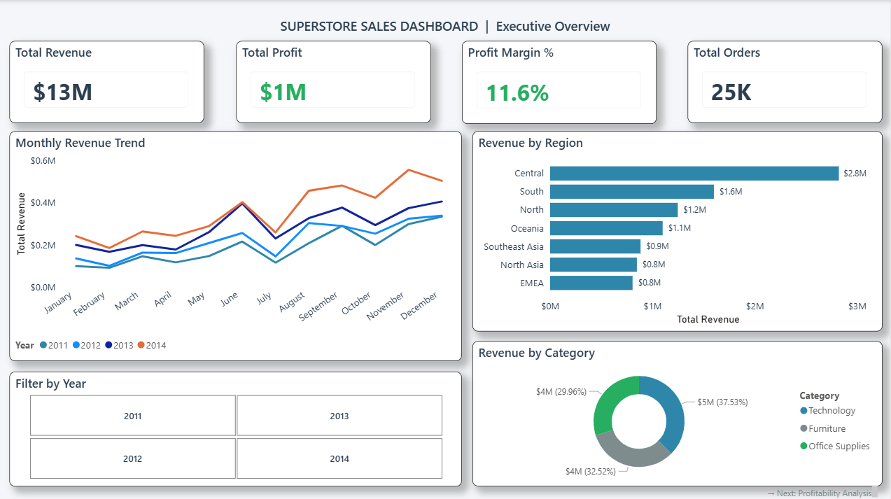
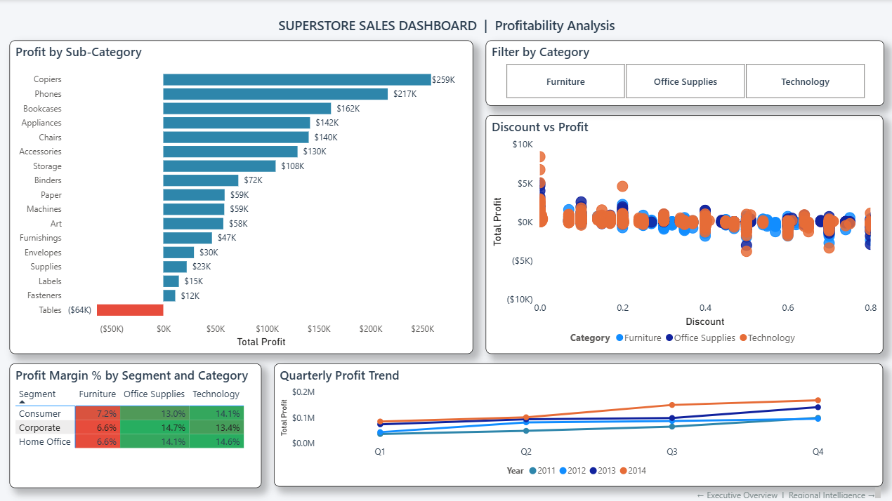
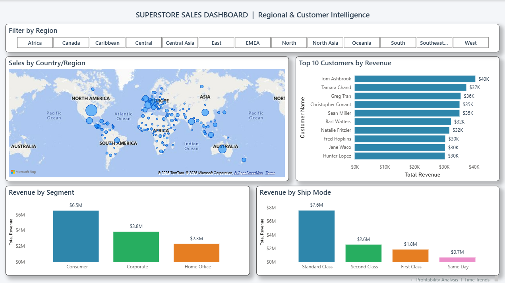
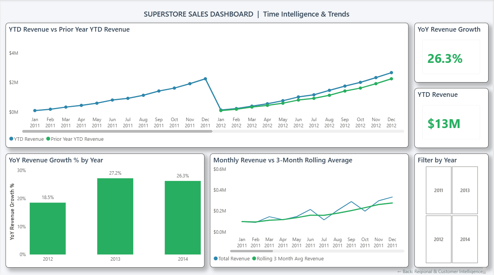

# 📊 Superstore Sales Dashboard — Power BI
### 4-Page Interactive Business Intelligence Dashboard | Global Retail Analytics


---

## 🧭 Project Overview

This project builds a 4-page interactive Power BI dashboard on the
**Global Superstore Sales dataset** — a real retail business spanning
4 years (2011–2014), 13 global regions, 3 product categories, and
3 customer segments.

The dashboard is designed to answer the questions a business
stakeholder would ask in a real management review: where is revenue
growing, where is margin being lost, which customers drive the most
value, and how is the business trending over time?

> **Core question:** *"What does $13M in global retail sales tell
> us about profitability, geography, customer behaviour, and
> year-over-year growth?"*

---

## 📋 Dashboard Pages

| Page | Title | Purpose |
|------|-------|---------|
| 1 | Executive Overview | Top-level KPIs, revenue trend, regional and category breakdown |
| 2 | Profitability Analysis | Sub-category profit/loss, discount impact, segment margins |
| 3 | Regional & Customer Intelligence | World map, top customers, segment and ship mode analysis |
| 4 | Time Intelligence & Trends | YTD vs Prior Year, YoY growth, rolling 3-month average |

---

## 📊 Key Business Insights

1. **Tables sub-category is loss-making at -$64K** — the only
   sub-category with negative total profit across 4 years.
   All other 16 sub-categories are profitable, with Copiers
   leading at $259K. This is a direct signal for a pricing
   or discount policy review on Tables.

2. **Revenue grew consistently: 18.5% → 27.2% → 26.3%
   (2012–2014)** — three consecutive years of double-digit
   YoY growth, with 2013 being the strongest year. The
   business shows no signs of deceleration as of 2014.

3. **Heavy discounting hurts profitability** — the Discount vs
   Profit scatter chart shows a clear downward trend: orders
   with discounts above 40% cluster near or below $0 profit.
   The Furniture category is most affected, with all three
   segments showing the lowest profit margins (6.6%–7.2%)
   compared to Technology (13.4%–14.6%).

4. **Central region dominates at $2.8M** — nearly double the
   second-highest region (South at $1.6M). Combined with the
   Top 10 Customers chart showing Tom Ashbrook leading at
   $40K lifetime revenue, geographic and customer concentration
   is a key business risk to monitor.

5. **Standard Class shipping accounts for $7.6M of $13M total
   revenue (58%)** — customers overwhelmingly prefer economy
   shipping, suggesting price sensitivity. Same Day shipping
   generates only $0.7M, indicating that premium delivery
   upselling is an untapped revenue opportunity.

---

## 🛠️ DAX Measures

All measures are stored in a dedicated `_DAXMeasures` table.

| Measure | Formula Logic | Purpose |
|---------|--------------|---------|
| `Total Revenue` | `SUM(Orders[Sales])` | Base revenue metric |
| `Total Profit` | `SUM(Orders[Profit])` | Base profit metric |
| `Profit Margin %` | `DIVIDE([Total Profit], [Total Revenue], 0)` | Margin efficiency |
| `Total Orders` | `DISTINCTCOUNT(Orders[Order ID])` | Order volume |
| `Avg Order Value` | `DIVIDE([Total Revenue], [Total Orders], 0)` | Per-order revenue |
| `YoY Revenue Growth %` | `DIVIDE(CurrentYear - PrevYear, PrevYear)` using `DATEADD` | Period-over-period growth |
| `YTD Revenue` | `TOTALYTD([Total Revenue], 'Date Table'[Date])` | Cumulative annual revenue |
| `Prior Year YTD Revenue` | `CALCULATE(TOTALYTD(...), SAMEPERIODLASTYEAR(...))` | Prior year comparison |
| `Rolling 3M Avg Revenue` | `AVERAGEX(DATESINPERIOD(..., -3, MONTH), ...)` | Trend smoothing |

---

## 📈 Dashboard Screenshots

### Page 1 — Executive Overview


### Page 2 — Profitability Analysis


### Page 3 — Regional & Customer Intelligence


### Page 4 — Time Intelligence & Trends


---

## 🔬 Dataset Description

| Field | Description |
|-------|-------------|
| `Order Date` | Date of purchase (2011–2014) |
| `Region` | 13 global regions (Central, South, North, EMEA etc.) |
| `Segment` | Consumer, Corporate, Home Office |
| `Category` | Technology, Furniture, Office Supplies |
| `Sub-Category` | 17 sub-categories (Copiers, Phones, Tables etc.) |
| `Sales` | Order revenue in USD |
| `Profit` | Net profit after costs |
| `Discount` | Discount rate applied (0 to 0.8) |
| `Ship Mode` | Standard Class, Second Class, First Class, Same Day |
| `Customer Name` | Individual customer identifier |

**Dataset:** Global Superstore Sales
**Rows:** 51,920 transactions
**Period:** January 2011 — December 2014
**Source:** Kaggle — Global Superstore Dataset

---

## 🛠️ Tools & Technical Stack

| Tool | Purpose |
|------|---------|
| **Power BI Desktop** | Dashboard development, visual building |
| **Power Query** | Data loading, column type fixing, Date Table creation |
| **DAX** | 9 custom measures including time intelligence |
| **Date Table** | Custom calendar table marked as date table, enabling `TOTALYTD`, `SAMEPERIODLASTYEAR`, `DATEADD` |

---

## 📁 Repository Structure

```
powerbi-superstore-dashboard/
│
├── dashboard/
│   ├── Superstore_Dashboard.pbix    # Power BI project file
│   └── Superstore_Dashboard.pdf     # Exported PDF — all 4 pages
│
├── data/
│   └── Global_Superstore.xlsx       # Source dataset
│
├── visuals/
│   ├── 01_executive_overview.png
│   ├── 02_profitability_analysis.png
│   ├── 03_regional_intelligence.png
│   └── 04_time_trends.png
│
└── README.md
```

---

## ▶️ How to Use

```
1. Download and install Power BI Desktop (free)
   https://powerbi.microsoft.com/desktop

2. Clone this repository

3. Open the dashboard file
   Power BI Desktop → File → Open → dashboard/Superstore_Dashboard.pbix

4. Enable map visuals if prompted
   File → Options → Security → Enable Map and Filled Map visuals → OK

5. Interact with the dashboard
   - Use year slicer on Page 1 to filter all visuals by year
   - Use category slicer on Page 2 to drill into specific categories
   - Click region tiles on Page 3 to filter the map and customer chart
   - Use year slicer on Page 4 to view time trends for specific years
   - Navigation hints at bottom of each page link between pages
```

**Requirements:** Power BI Desktop

---

## 👤 Author

**Kaushik Sahu**
B.Tech Biomedical Engineering, NIT Rourkela
Aspiring Data Analyst | Python · SQL · Power BI · Excel

📧 kaushiksahu866@gmail.com
🔗 [LinkedIn](https://www.linkedin.com/in/kaushik-sahu-37316a1b8/)
🐙 [GitHub](https://github.com/kaushiksahu866-data)

---
